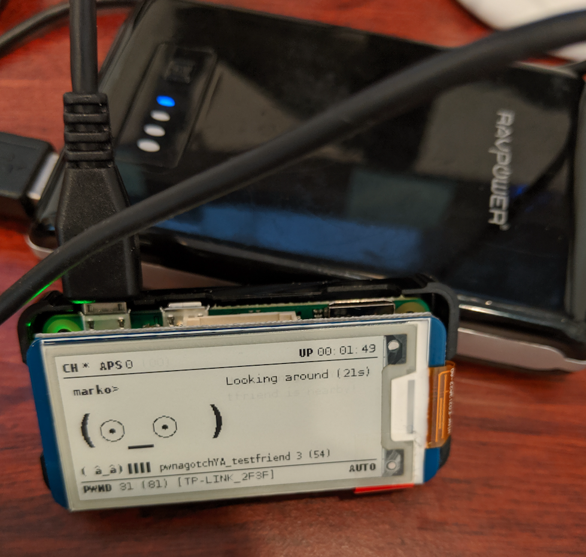

# pwnagotchya
Simple tool for fuzzing the pwnagotchi "friend" protocol. Is your [pwnagotchi](https://github.com/evilsocket/pwnagotchi/) lonely? Do you want to send weird faces? Have more friends than anyone? Find bugs in the friend protocol?
* PLEASE don't send this data upstream to the pwngrid, only use it for testing :-)
  * Set grid : enabled: and report: to false.
  * See: https://pwnagotchi.ai/configuration/#set-your-pwngrid-preferences

## Usage
* -i to specify interface in monitor mode
* -t to use a test file hardcoded to testfriend.json (not compatible with -f, currently -t takes precedence)
* -d to get some debug info on screen
* -f to fuzz the data - Currently DOES NOT WORK well. (not compatible with -t)

`sudo python3 pwnagotchya.py -i wlan1 -d -t`

## Requirements
Scapy. Python3.
I'm using an Alfa card on a RPi 4. Something you can put in monitor mode.

## TODO
Lots of todos in the code. I'll forget to list them here at some point.
- [x] working PoC
- [x] fix fuzz option so it doesn't build way too big packets
- [ ] add a mode to fuzz statically (i.e., send the same packet repeatedly, not fuzz every single time)
- [ ] options to fuzz/set specific parameters (setting can be accomplished now by using the testfriend.json)
- [ ] rewrite with boofuzz or something and have a connection to the gotchi to watch for odd results
- [ ] polishing

## Notes
- friend count seems to reset after 1000?
- friend name line gets really screwed up on e-ink display
